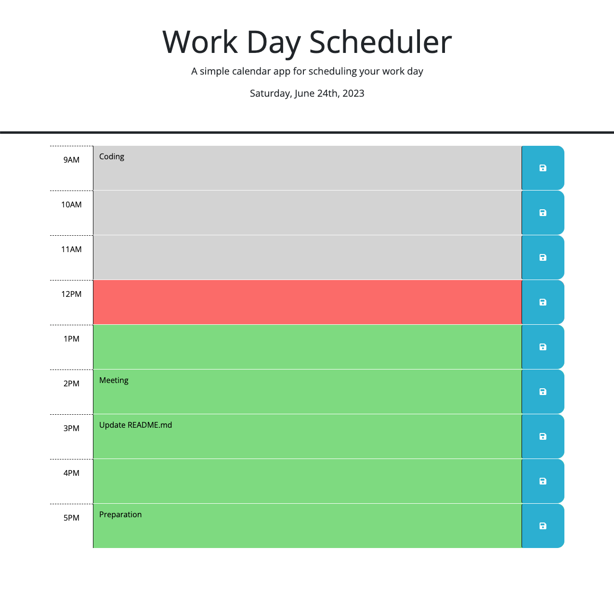
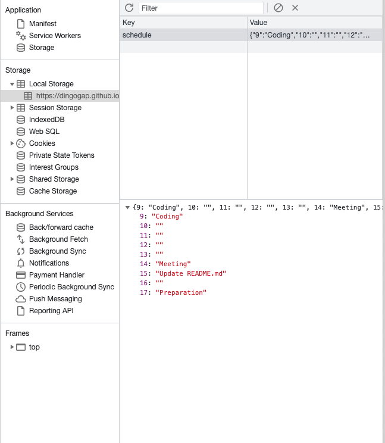

# 05-Third-Party-APIs-Work-Day-Scheduler

## Description
The Work Day Scheduler is a Daily Planner which allows the user to schedule items in any of the 1 hour Time Blocks in the current work day.

While not part of a comprehensive calendaring solution the Work Day Scheduler provides continuity by storing scheduled items in Local Storage so they can be seen next time the Scheduler is loaded.

Current Time Blocks are coloured Pink, Time Blocks from earlier in the day are coloured Grey and Time Blocks from later in the day are coloured Green.

In my implementation:

1. JavaScript is used:
    * to build the Time Block Structures so the scheduled hours can be changed easily
    * so schedule data and colour classes can be applied as the schedule is built
2. items can be added by entering the details in the appropriate Time Block and clicking the Save Button
3. items can be deleted by clearing the text from the Time Block and clicking the Save Button
4. the appropriate 'present' and future' colour classes will update on the hour change while the Scheduler is being used

## Third Party APIs Work Day Scheduler Link
Click the link to visit the deployed website: [Work Day Scheduler][def1].

## Data
  * Day Scheduler Hours are stored as global variables in the scrip.js file. Changing dayStart or dayEnd times will increase or reduce the number of Tiime Blocks in the scheduler
  * Scheduler data is stored in Local Storage in a key named 'schedule' so it is preserved between browser sessions or if the browser is refreshed
  * Scheduler data is stored in the planner object in the browser when the scheduler is running

Work Day Scheduler data is saved in Local Storage here:

## Navigation
Navigation is very simple:
1. Add an Entry:
  * click on the Time Block where the new event is to be added
  * enter the details
  * click on the flopy disk icon to save the data
2. Delete an Entry
  * click on the the Time Block to be cleared
  * delete the information
  * click on the floppy disk icon to update the entry

  ## Changelog
  The development is history is summaries in the [Changelog](./CHANGELOG.md)

## Resources Used
1. Bootcamp Materials - Lesson Material from Week 5
2. Prior knowlege and experience
3. Group tutorial sessions
4. [MDM Web Docs][def2] addEventListener Method
7. [MDM Web Docs][def3] setInterval() global function
8. [MDM Web Docs][def4] Element:prepend() method
9. [MDM Web Docs][def5] Array.prototype.sort()
10. [jQuery ][def6] jQuery API Documentation
11. [Day.js][def7] Day.js Documentation

[def1]: https://dingogap.github.io/05-Third-Party-APIs-Work-Day-Scheduler/
[def2]: https://developer.mozilla.org/en-US/docs/Web/API/EventTarget/addEventListenerl
[def3]: https://developer.mozilla.org/en-US/docs/Web/API/setInterval
[def4]: https://developer.mozilla.org/en-US/docs/Web/API/Element/prepend
[def5]: https://developer.mozilla.org/en-US/docs/Web/JavaScript/Reference/Global_Objects/Array/sort
[def6]: https://api.jquery.com/on/
[def7]: https://day.js.org/en/

